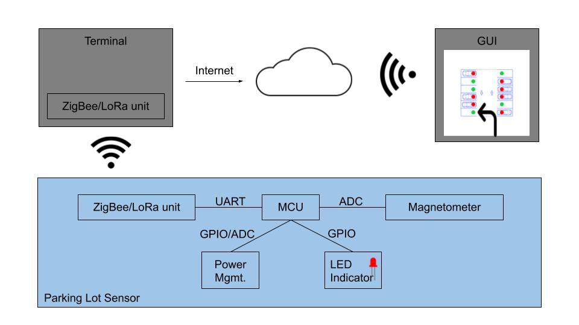

# Smart Parking Lot

ECE 189 - [Computer Engineering Capstone](https://web.ece.ucsb.edu/~yoga/capstone/), Professor Isukapalli

[View Repository on GitHub](https://github.com/andrewhlu/spl)

[Open Slack Workspace](http://ucsb-capstone-21.slack.com/)

[Meeting Notes](meeting-notes)

[Parts List / Budget Sheet](parts-list)

---

## Team Members

* Andrew Lu - Team Lead
* Finn Linderman
* Luyao Han
* Seungjun Cho

## Project Statement

The rapid advancement of cloud computing has boosted the development of IoT devices in recent years. For example, IoT devices are deployed into farms to monitor and manage the status of crops. In another case, a massive amount of IoT devices are used to gather the wind direction & speed data for predicting the weather. In this project, we want to take the advantage of the current IoT development and try to save drivers time while they are searching for an unoccupied parking spot. Specifically, we are aiming to design a smart parking lot to ease the process of finding a parking spot.

## Project Objective

In this project, you will design a smart parking lot prototype. Whenever a driver enters a parking lot, the driver can use his/her phone to open this parking lot app, from where he/she can tell what are the available spots. So instead of wandering around to find an empty spot, the driver can locate the empty spot right away and drive to the empty spot directly. To achieve the above features, this smart parking lot should be able to track which spot is occupied and which spot is available. As the front-end of this project, a web-based or phone-based app should indicate the driver where are the empty parking spots.

## Project Tasks

### System Overview
- Design a smart parking lot system to achieve the above features and draw block diagrams.
- In addition to just being functional, this system should also be achievable with a low price, mass deployable, and power saving.
- Consider the interfaces between different modules, such as what protocols should be used between the server and the IoT devices, or what are the arguments and return values of the APIs.

### Hardware Design
- Design the schematics.
- Verify the design using prototype and development boards.
- Develop the PCB for IoT devices targeting for deployment.
- Design necessary 3D parts to construct a mini parking lot for demo purposes.

### Software Design
- Server-side backend logic and APIs design.
- IoT devises firmware design, usually involves configuring interfaces like I2C, SPI, etc, communicating with sensors and managing threads if RTOS is used.
- Front-end application design.

## Block Diagram

This is our proposed system block diagram, as submitted in Milestone 1.

## Project Milestones

[Milestone 1](milestone1.pdf)

## Sensor Unit PCB Design
[PCB Schematics](sch.pdf)
#### Miscellaneous

#### Power Management

#### LoRa Comm

#### STM32 Microcontroller

[PCB Layout(Open With Kicad)](spl_prototype.zip)

