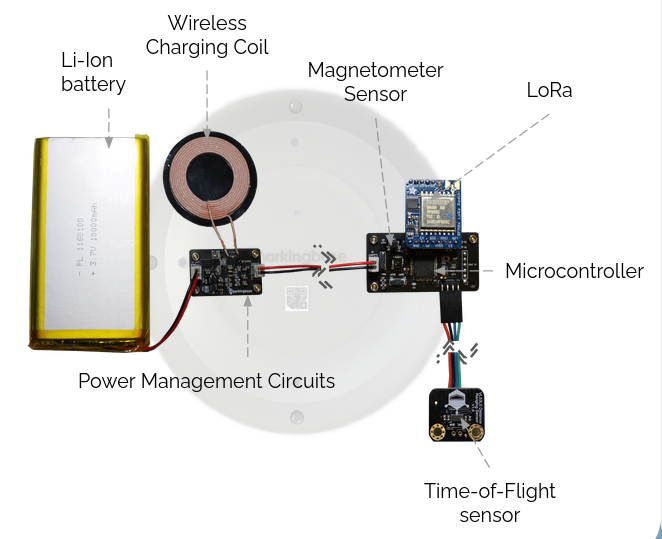

    

# Smart Parking Lot

A project for [ECE 189 - Computer Engineering Capstone](https://web.ece.ucsb.edu/~yoga/capstone/) led by Professor Isukapalli at UC Santa Barbara

---

[Parkingbase Demo Video](https://www.youtube.com/watch?v=abxjF7t0qpM)

[Parkingbase Poster](docs/poster.pdf)

---

## Team Members

* Andrew Lu
* Finn Linderman
* Luyao Han
* Seungjun Cho

## The Problem

Drivers spend too much time in parking lots trying to find an open space to park in. Many parking lots only have per-floor capacity indicators, and existing solutions are prohibitively expensive.

What if we could utilize low-cost sensors and a companion application to navigate drivers to empty parking spots faster, at a low cost to facility owners?

## Project Overview

**The goal of this project is to design a smart parking lot that will direct drivers to the nearest open parking space in an efficient, accurate, and clean manner.**

We accomplish this using:

* Small, inexpensive parking lot sensors with long-range and low-power transmission
* Modern, open-source, and cloud-based software solutions
* Easy-to-use mobile interfaces

# Technical Details

For a more detailed description, please take a look at our [project presentation slides](docs/final-presentation.pdf).

## System Overview

## Application Scene

## Block Diagram

  

## Sensor Unit Assembly

  
  
  

## Firmware Block Diagram

  

## Sensor Unit PCB Design

The raw Kicad design files can be found in the [pcb-design folder](https://github.com/andrewhlu/spl/tree/main/pcb_design) in our repo.

[PCB Schematic (as PDF)](docs/sch.pdf)

[PCB Schematic (as PNG Image)](docs/sch.png)

## GUI Screenshots

Driver User Interface:

Editor User Interface:

## Code Repositories

* [spl](https://github.com/andrewhlu/spl)
  * Documentation for this website
  * PCB Design files
  * Demo pictures
* [spl-web](https://github.com/andrewhlu/spl-web)
  * Code for our website, including the React frontend and backend API routes
* [parkingbase-auth](https://github.com/andrewhlu/parkingbase-auth)
  * Code for our custom authentication server

# Project Progress Updates

[Initial Design](docs/initial-design.pdf)

[Milestone 1](docs/milestone1.pdf)

[Milestone 2](docs/milestone2.pdf)

[Fall Quarter Review Presentation](docs/fall-quarter-review.pdf)

[Winter Quarter Review Presentation](docs/winter-quarter-review.pdf)

[Final Poster](docs/poster.pdf)

[Final Presentation](docs/final-presentation.pdf)

<!-- Custom CSS for GitHub Pages -->

